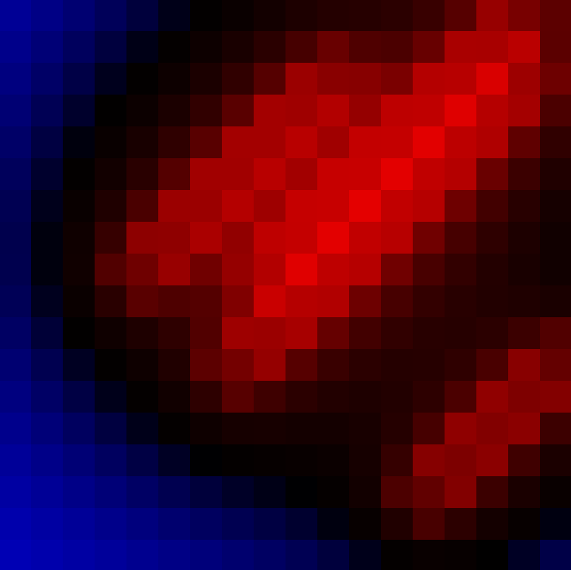

# Program Description

The *word-search* is a program in c++ that solves the problem of
searching words in a soup of characters. The *soup* is defined as a
matrix of characters of size $N \times M$, or equivalently in c++,
$char[N][M]$. The words to be searched are movie titles given as
$vector<strings>$. Then the words are searched in the soup and the
program will know which movies are in the soup and which are not.

# Program Structure

*word-search* will be divided in the following parts:

1.  The input loader

2.  The parser.

3.  The solver.

4.  The output handler.

## Input Loader

The input loader will define how input is handled and introduced to the
program. For the moment, the case considered will be the input given as
a $string$ in $cin$ which represents the name of the .txt file, and is
assumed to be located in the same directory as of the program. Other
potential inputs could be a user-typed movie title, a $path$ to a .txt
file, or a initialization of a .txt file with multiple movie titles
typed by the user thorugh the console.

## Parser

The parser will be a collection of functions that take an ifstream to
process the input file until all the information is stored as c++ data
types. The parser have to consider multiple cases in order to collect
the data correctly. For that reason let me define the input file format
first.

### Input File Format

The format of the .txt file will be as follows:

1.  The first block is a single line with a pair of numbers $N$ and $M$
    separated by a space. $N$ is the number of rows and $M$ is the
    number of columns.

2.  The second block is a $char$ matrix of $N$ rows and $M$ columns.

3.  The third block is a list of words to be searched in the matrix.

Now consider that the file may have comment lines anywhere including
inside the blocks of inputs. Comment lines should be treated as if the
parser had never seen them.

### Parser Definition

I will define the parser to be a set of functions that will take as
input the .txt file and will return all the useful information
interpretet as c++ data types. Such information could be:

1.  The entry size of the matrix $N$ and $M$: $const\ int\ N, M$.

2.  The declaration of the characters of the matrix: $char[N][M]$.

3.  The list of words to be searched: $vector<string>$.

-----------------
TODO: add definitions for the heat maps and their related ppm files generated from the movie titles search results

 

